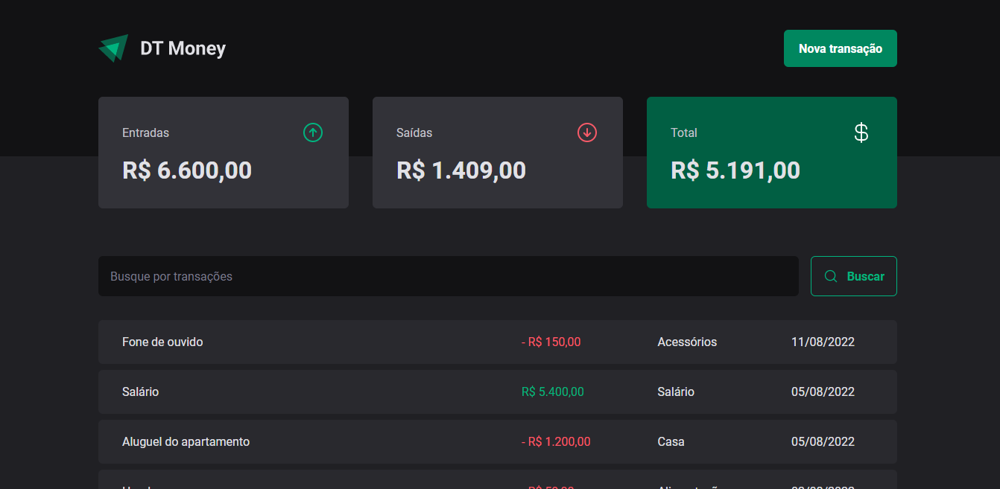

# DT Money

## 💻 Projeto

Projeto Web desenvolvido durante o Bootcamp Ignite da Rocketseat no Trilha ReactJS

## ✨ Tecnologias

- [React](https://react.dev/)
- [Vite](https://vitejs.dev/)
- [Typescript](https://www.typescriptlang.org/)
- [Styled Components](https://styled-components.com/)
- [Radix UI](https://www.radix-ui.com/)
- [React Hook Form](https://react-hook-form.com/)

## 🚀 Como executar

- Clone o repositório
- Rode `yarn` para baixar as dependências
- Rode o `yarn server` para iniciar a o servidor `JSON` na porta `3333`.
- Rode o `yarn dev` para iniciar a aplicação.